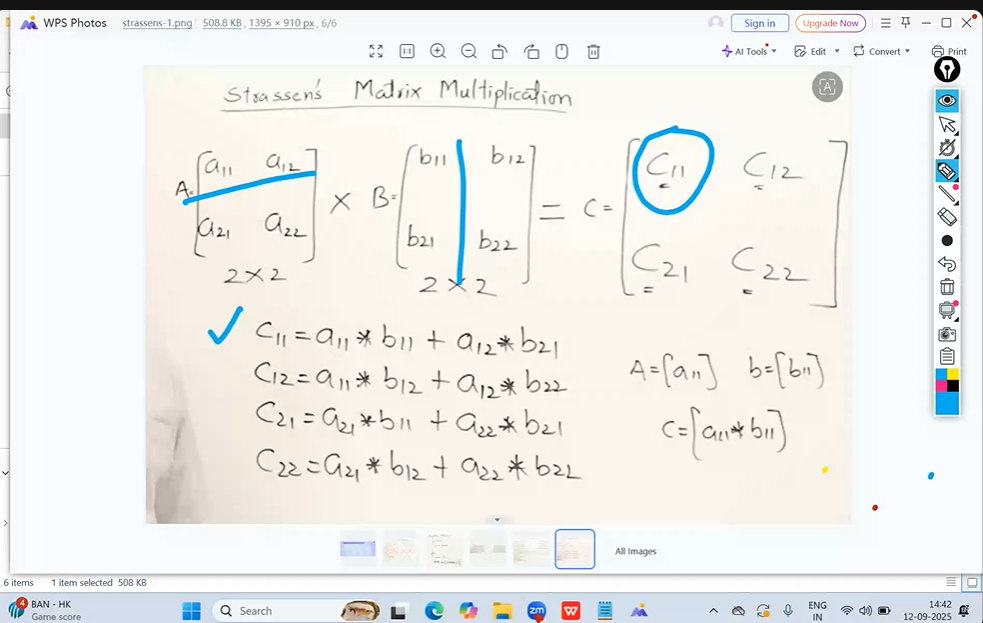
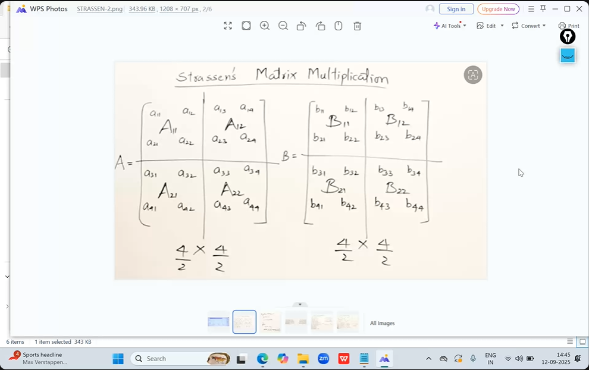

# Advandced Data Structures and Algorithm

## Strassens Algorithm
This is exclusively for matrix mutiplication, especially order above `3x3` matrices.

Normal matrix time complexity is O(n^3), whereas strassens time complexity is O(n^2.82) or O(n^2.83)

**Matrix 1**

```python
A = [
    [1, 2, 3],
    [4, 5, 6],
    [7, 8, 9]
]
B = [
    [9, 8, 7],
    [6, 5, 4],
    [3, 2, 1]
]

C = A*B

c = [
    [30, 24, 18],
    [84, 69, 54],
    [138, 114, 90]
]

```







Spit the `4x4` matrix into 4 sub matrices of size `2x2`