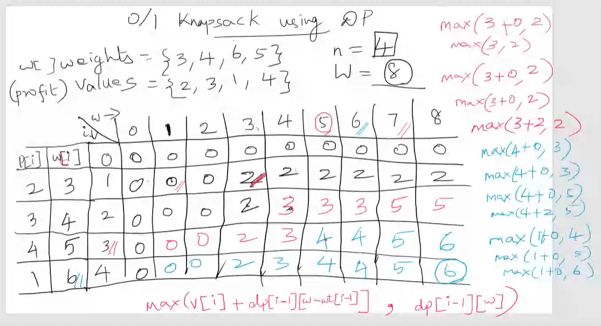

# Knapsack
**Explanation**: Given with a sack with a capacity and a list of item with their induvidual occupancy. 

### 2 Types
* Fractional 
* 0 or 1


## Example 1

We are running a grossary shop. We have
```python
items = { pulses, cereals, saffron, cardamom, jeera } # Available induvidual items
weight = { 10, 8, 2, 3, 5 } # induvidual weight for above items
cost = { 3, 2, 6, 5, 2 } # induvidual cost for above itmes
```

| Items     | Weight| Cost  |
| --        | --    | --    |
|Pulses     | 10    | 3     |
|Cereal     | 8     | 2     |
|Saffron    | 2     | 6     |
|Cardamom   | 3     | 5     |
|Jeera      | 5     | 2     |


We need to fill a given sack so that we can get most price in returns with least amount to items sold.

## Example 2

You are a theif and you are going to steal in a shop.
```python
items = { A, B, C, D }
weight = { 3, 4, 6, 5 }
cost = { 2, 3, 1, 4 }
```
Let the _maximum no. of items_ that can be accomodated by the sack be 4

Let the _maximum weight of items_ that can be accomodated by the sack be 8


**Formula:** `max( v[i] + dp[i-1][ W - wt[i-1]], dp[i-1][W] )`

Here
* _i_ = item
* _v_ = value
* _wt_ = weight
* _v[i]_ = value of item _i_
* _wt[i]_ = weight of item _i_
* _W_ = Maxmimum weight 
* _dp_ = Previour row

---


  .     |        | i\w   | 0 | 1 | 2 | 3 | 4 | 5 | 6 | 7 | 8 |
 ------ | -----  | ----- |-- |-- |-- |-- |-- |-- |-- |-- |-- |
**v[i]**|**w[i]**|   0   | 0 | 0 | 0 | 0 | 0 | 0 | 0 | 0 | 0 |
  2     |  3     |   1   | 0 | 0 | 0 | 2 | 2 | 2 | 2 | 2 | 2 |
  3     |  4     |   2   | 0 | 0 | 0 | 2 | 3 | 3 | 3 | 5 | 5 |
  4     |  5     |   3   | 0 | 0 | 0 | 2 | 3 | 4 | 4 | 5 | 6 |
  1     |  6     |   4   | 0 | 0 | 0 | 2 | 3 | 4 | 4 | 5 | 6 |




Thus the maximum profit is **6**