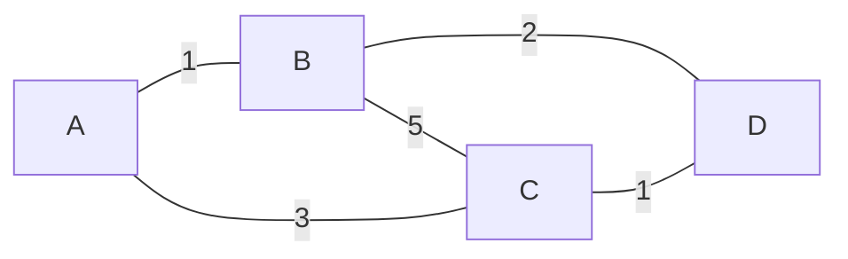
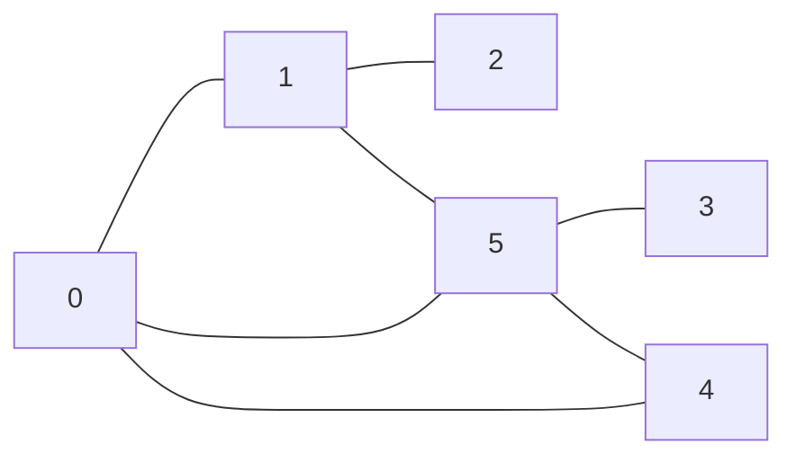
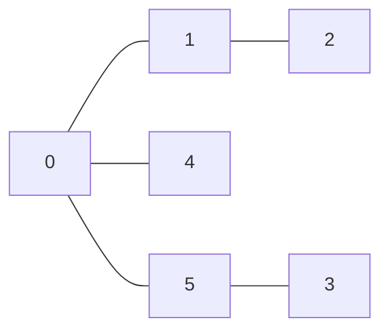
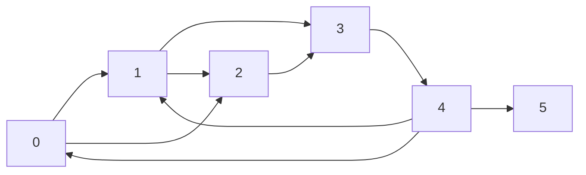

# Graphs
## combination of vertices and edges 

**Usage** - Social media application

**Graph** - Directed and Undirected

 - Directed (Uni-directed graph) - Twitter 
 - Directed (Bi-directed graph) - Instagram
 - Undirectde Graph - LinkedIn Connections

Island and Forest - Graph Concepts

1. Connected Graph: All nodes are somehow connected directly/indirectly
2. Disconnected / Non-Connected Graph: Few parts of the graphs are not connected in that condition, it is called Islands

Group of Islands are called Forest 

## Weighted graph and Non-weighted graph
*Weighted Graph* - Every edge will have a cost

## Cyclic and Acyclic Graph
*Cyclic graphs* - Cycles will be present in the graph
*Acyclic graphs* 
    - Cycles will **not** be present in the graph
    - All trees are *acyclic* graphs

## Graph representation:
    - Adjacency Matrix
    - Adjacency List

Let there be a graph

[1]--[2]--[3]--[4]

*Adjacency Matrix*

|   | 1 | 2 | 3 | 4 |
|:-|:-|:-|:-|:-|
| 1 | 0 | 1 | 0 | 0 |
| 2 | 1 | 0 | 1 | 0 |
| 3 | 0 | 1 | 0 | 1 |
| 4 | 0 | 0 | 1 | 0 |

|   | A | B | C | D |
| :- | :- | :- | :- | :- |
| A | 0 | 1 | 3 | 0 |
| B | 1 | 0 | 5 | 2 |
| C | 3 | 5 | 0 | 1 |
| D | 0 | 2 | 1 | 0 |

## Graph Traversal

+ BFS
+ DFS

**BFS** - Implemented using `Queue`  
**DFS** - Implemented using `Stack`

> [!NOTE]
> In trees, we will be starting from root, but in graphs we can start from any node and the answer will change accordingly

## BFS
+ Here we should start from any vertix and print the vertix
+ Then print (visit) the adjecent vertices
+ Then print (visit) their adjecent vertices
+ Ignore the vertices that are already visited

### Bookish definition
+ BFS starts from a node, write all of its adjecent nodes
+ From adjecents, pick one and write all of its adjecent node and repeat the same
+ If a node is already visited, don't visit it again.

### Original graph

### Spanning Graph

BFS Traversal: 
0 -> [1, 4, 5]  
1 -> [2 ]  
5 -> [3 ]  

## DFS
+ Here we shall start from any vertex from the graph
+ Then choose any one adjecent node and explore all the adjecent of adjecent.. vertices
+ Similar to *BFS* ignore all the repeating vertices

### Bookish definition
+DFS start form a node, write any one of it's adjecent nodes
+For that node, check all adjecent node and write any one again, repeat the same
> [!Note] 
> At last add reset of the unvisited nodes

### Given Directed Graph
