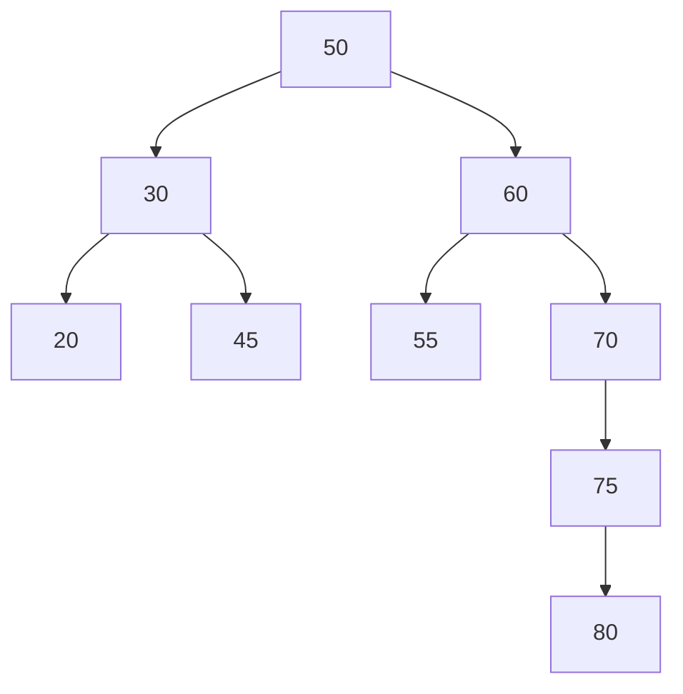

# AVL Tree

When BST becomes a skewed tree, searching for a particular element especially the leaf-node will make it as a linear search and it ends up with less effeciency. 
So in order to maintain the effeciency, we need to make the tree as balanced tree.

>[!NOTE]
>When we are trying to create a balanced tree, we are reducing the height of the tree

Definition:
* It should be a BST
* Balance Fatcor (BF) for every node should be either `0`, `1`, or `-1`. Else we have to balance the tree

Calculating the Balance Factor:
* Balance factor = Height(left subtree) - Height(right subtree)

* 50's balance factor = 2-4 = -2
* 30's balance factor = 1-1 = 0
* 60's balance factor = 1-3 = -2
* 70's balance factor = 0-2 = -2
* 75's balance factor = 0-1 = -1

The nodes `50`, `60`, and `70` are confilicting with the AVL rules.  
These nodes are called **Critical Node**.  
**Reason:** The balance factor is not 0, 1, or -1.  

## AVL rotations

* RR rotation - Right Right
* LL rotation - Left Left
* LR rotation - Left Right
* RL rotation - Right Left

> [!NOTE]
> RR and LL are single rotations  
> RL and LR are double rotations

## AVL Construction
