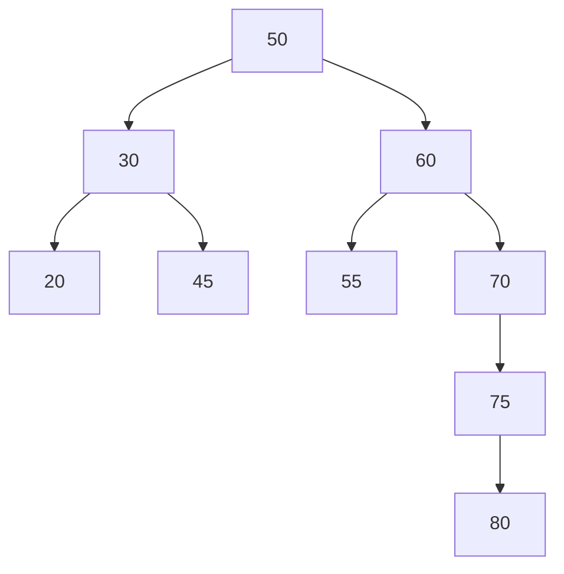

When BST becomes a skewed tree, searching for a particular element especially the leaf-node will make it as a linear search and it ends up with less effeciency. 
So in order to maintain the effeciency, we need to make the tree as balanced tree.

>[!NOTE]
>When we are trying to create a balanced tree, we are reducing the height of the tree

Definition:
* It should be a BST
* Balance Fatcor (BF) for every node should be either `0`, `1`, or `-1`. Else we have to balance the tree

Calculating the Balance Factor:
* Balance factor = Height(left subtree) - Height(right subtree)

